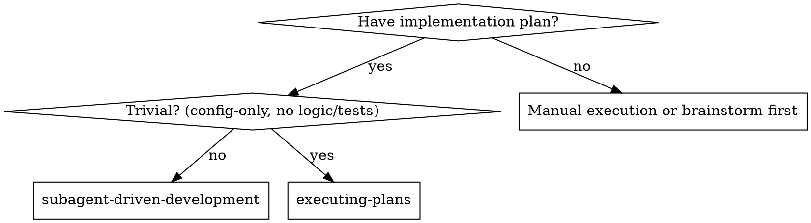
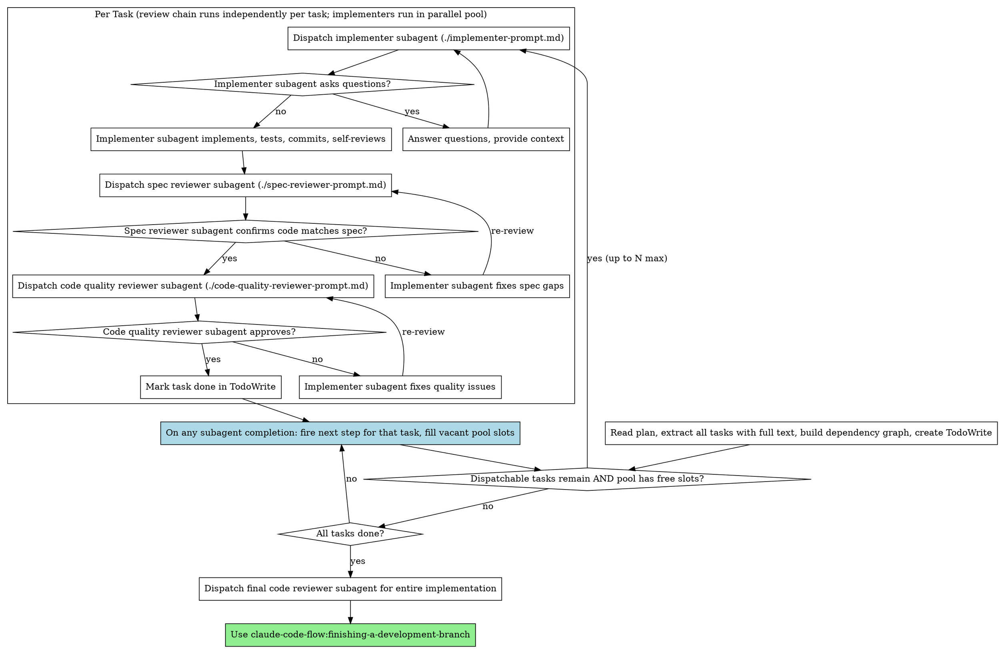

# Subagent-Driven Development

Execute plan by dispatching fresh subagent per task, with two-stage review after each: spec compliance review first, then code quality review.

**Why subagents:** You delegate tasks to specialized agents with isolated context. By precisely crafting their instructions and context, you ensure they stay focused and succeed at their task. They should never inherit your session's context or history — you construct exactly what they need. This also preserves your own context for coordination work.

**Core principle:** Fresh subagent per task + two-stage review (spec then quality) = high quality, fast iteration

**Continuous execution:** Do not pause to check in with your human partner between tasks. Execute all tasks from the plan without stopping. The only reasons to stop are: BLOCKED status you cannot resolve, ambiguity that genuinely prevents progress, or all tasks complete. "Should I continue?" prompts and progress summaries waste their time — they asked you to execute the plan, so execute it.

## When to Use



**Default: subagent-driven.** Only fall back to executing-plans for trivial tasks (config-only, no new logic, no tests, no review loop).
- Same session (no context switch)
- Fresh subagent per task (no context pollution)
- Two-stage review after each task: spec compliance first, then code quality
- Faster iteration (no human-in-loop between tasks)

## The Process



## Parallel Execution

Tasks that share no files or dependencies can implement in parallel. Use a pool model: up to `CCF_MAX_PARALLEL_AGENTS` concurrent implementers (default 5). Reviews happen in-chain per task — when any implementer finishes, its spec and code reviewers fire immediately, overlapping with other implementers still running. The pool stays full until all tasks are dispatched.

**Task dependency graph:** Each task may declare a `depends_on` field listing task IDs it requires to be `done` before it can be dispatched. A task is dispatchable when all its declared dependencies are `done`. Tasks with no `depends_on` field are dispatchable immediately.

**Event-driven dispatch rules:**

1. When a plan is loaded, extract all tasks and build the dependency graph
2. Dispatch all immediately-dispatchable tasks, up to the pool limit
3. On any subagent completion event, immediately:
   a. Fire the next step for that specific task (implementer done → spec reviewer; spec reviewer passed → code reviewer; code reviewer passed → mark done)
   b. While pool has free slots AND dispatchable tasks remain: dispatch the next implementer
4. Review chains can overlap — spec reviewer for Task A runs while Task B's implementer is still coding
5. Continue until all tasks are done and all reviews are complete

**All subagents work in the same worktree.** This works because independent tasks are designed not to conflict — they touch different files or different parts of the same file with no logical overlap.

**Cost/benefit tradeoff:** If `CCF_MAX_PARALLEL_AGENTS=1`, the process is identical to sequential execution. For plans with many independent tasks, higher concurrency dramatically reduces wall-clock time. Independent tasks by design don't interfere, so the risk of merge conflicts is minimal.

## Model Selection

Use the least powerful model that can handle each role to conserve cost and increase speed.

**forge** (Sonnet) — general implementation, backend + frontend, full-stack work. Use `./forge-implementer-prompt.md`.

**oracle** (Opus) — planning, architecture, system decomposition. Use `./oracle-planner-prompt.md`.

**prism** (Sonnet) — testing, builds, acceptance verification. Use `./prism-verifier-prompt.md`.

**Default implementer** — for straightforward mechanical tasks (1-2 files, complete spec). Use `./implementer-prompt.md`.

**Task complexity signals:**
- Touches 1-2 files with a complete spec → default implementer (cheap model)
- Full-stack, UI, multi-file coordination → forge (Sonnet)
- Requires plan creation or architecture → oracle (Opus)
- Requires test engineering or acceptance gate → prism (Sonnet)

## UI Implementation Constraint

For tasks involving visible UI, read the approved root `DESIGN.md` before dispatching the implementer. Include the relevant tokens, layout rules, component states, accessibility requirements, and path to `.claude/research/<task-name>/ui-research.md` in the implementer prompt. UI implementation that ignores approved `DESIGN.md` is not spec compliant. Spec review verifies the task matches the plan; design review verifies UI work matches `DESIGN.md`. Do not let spec review substitute for design review when `DESIGN.md` exists.

## Handling Implementer Status

Implementer subagents report one of four statuses. Handle each appropriately:

**DONE:** Proceed to spec compliance review.

**DONE_WITH_CONCERNS:** The implementer completed the work but flagged doubts. Read the concerns before proceeding. If the concerns are about correctness or scope, address them before review. If they're observations (e.g., "this file is getting large"), note them and proceed to review.

**NEEDS_CONTEXT:** The implementer needs information that wasn't provided. Provide the missing context and re-dispatch.

**BLOCKED:** The implementer cannot complete the task. Assess the blocker:
1. If it's a context problem, provide more context and re-dispatch with the same model
2. If the task requires more reasoning, re-dispatch with a more capable model
3. If the task is too large, break it into smaller pieces
4. If the plan itself is wrong, escalate to the human

**Never** ignore an escalation or force the same model to retry without changes. If the implementer said it's stuck, something needs to change.

## Prompt Templates

**Implementers:**
- `./implementer-prompt.md` - Default implementer (mechanical tasks, cheap model)
- `./forge-implementer-prompt.md` - Forge implementer (full-stack, UI, multi-file)

**Planner:**
- `./oracle-planner-prompt.md` - Oracle planner (architecture, task decomposition)

**Reviewers:**
- `./spec-reviewer-prompt.md` - Spec compliance reviewer
- `./code-quality-reviewer-prompt.md` - Code quality reviewer
- `./design-reviewer-prompt.md` - Design compliance reviewer for UI work against `DESIGN.md`
- `./prism-verifier-prompt.md` - Prism verifier (test engineering, build, acceptance)

**Specialized:**
- `./researcher-prompt.md` - Researcher (writes `.claude/research/<task-name>/<research-type>-research.md`)
- `./designer-prompt.md` - Designer (UI/UX research, `.claude/research/<task-name>/ui-research.md`, root `DESIGN.md` output)

## Example Workflow

```
You: I'm using Subagent-Driven Development to execute this plan.

[Read plan file once: .claude/plans/feature-plan.md]
[Extract all 5 tasks with full text and context]
[Build dependency graph: Task 3 depends_on [Task 1]; Tasks 2,4,5 independent]
[Create TodoWrite with all tasks]
[CCF_MAX_PARALLEL_AGENTS=3. Dispatchable now: Task 1, Task 2, Task 4 → dispatch all 3]

=== Pool: [Task 1 implementing, Task 2 implementing, Task 4 implementing] ===

[Task 2 implementer finishes first]
Implementer (Task 2):
  - Added verify/repair modes
  - 8/8 tests passing
  - Self-review: All good
  - Committed

[Dispatch Task 2 spec reviewer]  ← fires immediately, Task 1 & 4 still implementing
[Pool slot free: dispatch Task 5 (dispatchable, independent)]
=== Pool: [Task 1 implementing, Task 4 implementing, Task 5 implementing] ===

[Task 2 spec reviewer completes] Spec reviewer: ✅ Spec compliant

[Dispatch Task 2 code quality reviewer]  ← still overlapping with implementers
Code reviewer: Strengths: Solid. Issues (Important): Magic number (100)

[Task 2 implementer fixes → re-review → ✅ Approved]
[Mark Task 2 done]  ← Task 3 now dispatchable (depends_on Task 1 still in progress, not Task 2 → waits)

[Task 1 implementer finishes with question]
Implementer (Task 1): "Should the hook be installed at user or system level?"
You: "User level (~/.config/claude-code-flow/hooks/)"

Implementer (Task 1): [Proceeds, implements, commits]
[Dispatch Task 1 spec reviewer]  ← Task 4 & 5 still implementing

Spec reviewer (Task 1): ✅ Spec compliant
[Dispatch Task 1 code quality reviewer]
Code reviewer (Task 1): ✅ Approved
[Mark Task 1 done]  ← Task 3 NOW dispatchable (Task 1 done)
[Pool slot free: dispatch Task 3]
=== Pool: [Task 4 implementing, Task 5 implementing, Task 3 implementing] ===

[Task 4 implementer finishes → spec review → code review → approved]
[Mark Task 4 done]
[Pool slot free, no more dispatchable tasks]

[Task 5 implementer finishes → spec review finds issues → fix → re-review → approved]
[Mark Task 5 done]

[Task 3 implementer finishes → spec review → code review → approved]
[Mark Task 3 done]

[All tasks done]
[Dispatch final code-reviewer]
Final reviewer: All requirements met, ready to merge

Done! Wall-clock: ~3 concurrent streams instead of 5 sequential rounds.
```

## Advantages

**vs. Manual execution:**
- Subagents follow TDD naturally
- Fresh context per task (no confusion)
- Parallel-safe (subagents don't interfere)
- Subagent can ask questions (before AND during work)

**vs. Executing Plans:**
- Same session (no handoff)
- Continuous progress (no waiting)
- Review checkpoints automatic

**Efficiency gains:**
- No file reading overhead (controller provides full text)
- Controller curates exactly what context is needed
- Subagent gets complete information upfront
- Questions surfaced before work begins (not after)
- Independent tasks implement in parallel (wall-clock reduction up to Nx)
- Reviews overlap with implementation (no idle time between tasks)

**Quality gates:**
- Self-review catches issues before handoff
- Two-stage review: spec compliance, then code quality
- Review loops ensure fixes actually work
- Spec compliance prevents over/under-building
- Code quality ensures implementation is well-built

**Cost:**
- More subagent invocations (implementer + 2 reviewers per task)
- Controller does more prep work (extracting all tasks upfront)
- Review loops add iterations
- But catches issues early (cheaper than debugging later)

## Red Flags

**Never:**
- Start implementation on main/master branch without explicit user consent
- Skip reviews (spec compliance OR code quality)
- Proceed with unfixed issues
- Make subagent read plan file (provide full text instead)
- Skip scene-setting context (subagent needs to understand where task fits)
- Ignore subagent questions (answer before letting them proceed)
- Accept "close enough" on spec compliance (spec reviewer found issues = not done)
- Skip review loops (reviewer found issues = implementer fixes = review again)
- Let implementer self-review replace actual review (both are needed)
- **Start code quality review before spec compliance is ✅** (wrong order)
- Skip approved source `DESIGN.md` for UI work
- Use a `DESIGN.md` summary or spec summary instead of reading the source `DESIGN.md`
- Let spec review substitute for design review when reviewing against `DESIGN.md`
- Treat researcher/designer summaries as enough when saved research files are required
- Mark a task done while either review has open issues for that task
- Dispatch tasks that share files or dependencies in parallel
- Dispatch tasks whose `depends_on` are not all `done`

**Always:**
- Respect task dependency graph — don't dispatch tasks whose `depends_on` aren't `done`
- Build dependency graph from plan before dispatching any subagent
- Fill pool to capacity with dispatchable tasks on every completion event

**If subagent asks questions:**
- Answer clearly and completely
- Provide additional context if needed
- Don't rush them into implementation

**If reviewer finds issues:**
- Implementer (same subagent) fixes them
- Reviewer reviews again
- Repeat until approved
- Don't skip the re-review

**If subagent fails task:**
- Dispatch fix subagent with specific instructions
- Don't try to fix manually (context pollution)

## Integration

**Required workflow skills:**
- **claude-code-flow:using-git-worktrees** - Ensures isolated workspace (creates one or verifies existing)
- **claude-code-flow:writing-plans** - Creates the plan this skill executes
- **claude-code-flow:requesting-code-review** - Code review template for reviewer subagents
- **claude-code-flow:finishing-a-development-branch** - Complete development after all tasks

**Subagents should use:**
- **claude-code-flow:test-driven-development** - Subagents follow TDD for each task

**Alternative workflow:**
- **claude-code-flow:executing-plans** - Use for parallel session instead of same-session execution
