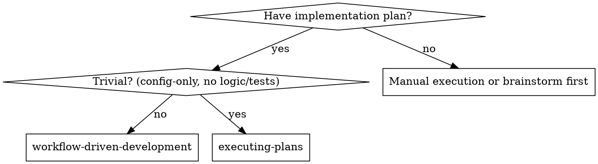

# Workflow-Driven Development

Orchestrate implementation plan execution via Claude Code Dynamic Workflows. You prepare the plan context and build workflow arguments; the Workflow runtime handles parallel dispatch, review chains, retry loops, and progress tracking.

## When to Use



**Default: workflow-driven.** Only fall back to executing-plans for trivial tasks (config-only, no new logic, no tests, no review loop).

**Continuous execution:** Do not pause to check in with your human partner between tasks. The workflow runs autonomously in the background. The only reasons to stop are: BLOCKED tasks you cannot resolve after workflow completion, ambiguity that genuinely prevents progress, or all tasks complete. "Should I continue?" prompts and progress summaries waste their time — they asked you to execute the plan, so execute it.

## How It Works

You do four things:

1. **Prepare context** — read the plan, extract tasks, build dependency graph
2. **Build args** — construct the workflow args object with groups and tasks
3. **Launch** — call `Workflow()` once; it runs in the background
4. **Handle results** — inspect `results.completed`, `results.blocked`, `results.final_review`

The Workflow runtime executes `execute-plan.workflow.js`, a self-contained script that embeds all prompt logic (behavioral guards, self-review checklists, adversarial review stances) drawn from the canonical prompt templates. You do not manage pools, review triggers, or retry logic — the runtime does that.

## Step 1: Prepare Context

Read the plan file once. For every task, extract:

- `id` — task identifier (e.g. "task-1")
- `description` — the FULL text from the plan (all implementation details)
- `depends_on` — array of task IDs this task must wait for (empty if none)
- `complexity` — simple, full-stack, ui, design, research

Build the dependency graph. Group tasks by topological level:

- Level 0: tasks with empty `depends_on`
- Level 1: tasks that depend only on Level 0 tasks
- Level N: tasks that depend only on earlier levels

Read `./execute-plan.workflow.js` — this is the workflow script. The script is self-contained: all agent prompts (behavioral guards, self-review checklists, review dimensions) are embedded in it.

If any task involves UI, read the root `DESIGN.md`. Include relevant design tokens, layout rules, component states, and accessibility requirements in that task's description text.

## Step 2: Build Args

Construct the `args` object:

| Key | Value |
|-----|-------|
| `groups` | Array of arrays. `groups[0]` = Level 0 task IDs, `groups[1]` = Level 1, etc. |
| `tasks` | Object keyed by task ID. Each value: `{id, description}` — description is the FULL plan text for that task |
| `worktree` | Absolute path to current worktree |
| `model_tasks` | `null` (use session model) or a model name string (see Model Selection) |

The workflow script embeds all prompt content — you only pass data. No prompt templates to read or pass.

For **full-auto pipeline mode**, also read `./full-auto-pipeline.workflow.js` and construct the extended args with `task`, `specs_dir`, `plans_dir`, `execute_plan_script_path`, `model_tasks`, `max_retries`.

## Step 3: Launch

```
Workflow({
  script: <contents of execute-plan.workflow.js>,
  args: { groups, tasks, worktree, model_tasks }
})
```

Announce: "Using workflow-driven development: N tasks in M dependency groups."

The workflow runs in the background. Use `/workflows` to watch progress. Your session stays responsive — you can continue other work while the workflow executes.

## Step 4: Handle Results

When the workflow completes, inspect the returned `results` object:

**`results.completed[]`** — tasks that passed all reviews. Each entry has:
- `id` — task identifier
- `spec_passed` — boolean
- `code_passed` — boolean
- `code_review` — full review result with `issues[]` and `summary`
- `files` — array of files modified

**`results.blocked[]`** — tasks the workflow could not complete:
- `id` — task identifier
- `reason` — why it was blocked
- `impl` — last implementation attempt result

**`results.final_review`** — cross-task code review (present if all tasks passed). If it has Critical issues, fix them before proceeding.

If all tasks are in `results.completed` and `results.final_review` has no Critical issues, proceed to **claude-code-flow:finishing-a-development-branch**.

### Handling Blocked Tasks

For each task in `results.blocked[]`:

1. **Re-dispatch with a more capable model** — if the task requires more reasoning, use forge or oracle
2. **Split into smaller sub-tasks** — if the task was too large for one agent
3. **Escalate to your human partner** — if the plan itself is wrong

Never re-dispatch the same task with the same model and same instructions. If the workflow's built-in retry could not complete it, something needs to change.

## Task Status Handling

The workflow handles implementer statuses automatically:

| Status | Workflow Behavior |
|--------|------------------|
| **DONE** | Proceeds to spec review automatically |
| **DONE_WITH_CONCERNS** | Concerns flow into review context. If about correctness/scope, surface in spec review. If observations (e.g. "file getting large"), noted but workflow proceeds. |
| **BLOCKED** | Workflow retries once with a self-service prompt. If still BLOCKED, task appears in `results.blocked[]`. |

The workflow implements retry loops: up to 5 iterations per review stage. Spec review failures trigger fix-and-re-review. Code quality Critical issues trigger fix-and-re-review. Important and Minor code issues are reported but do not block progression.

## Model Selection

Set `model_tasks` in workflow args to override the session model for all workflow agents:

| Model | Role | When to Use |
|-------|------|-------------|
| Default (session model) | General implementation | Mechanical tasks: 1-2 files, complete spec |
| **forge** (Sonnet) | Full-stack implementation | Multi-file coordination, UI, complex logic |
| **oracle** (Opus) | Planning, architecture | System decomposition, ambiguous requirements |
| **prism** (Sonnet) | Verification | Test engineering, build, acceptance gates |
| **artist** (Sonnet) | Image generation | Visual asset creation and editing |

**Task complexity signals:**
- Touches 1-2 files, complete spec → default
- Full-stack, UI, multi-file coordination → forge
- Requires plan creation or architecture → oracle
- Requires test engineering or acceptance gate → prism
- Image generation or editing → artist

The workflow script embeds all prompt content (behavioral guards, self-review checklists, review dimensions). `model_tasks` sets the model for all workflow agents — the same prompts are used regardless of model. The canonical prompt files (`implementer-prompt.md`, `forge-implementer-prompt.md`, etc.) are reference documentation for non-workflow use.

## Image Generation

For tasks that generate or edit images, set the task model to artist. The workflow handles image tasks in the same implement → review chain. Artist agents return output paths plus a manifest. Tasks with missing output files or BLOCKED status appear in `results.blocked[]`.

## UI Implementation

For tasks involving visible UI, read the root `DESIGN.md` and include relevant design content (tokens, layout rules, component states, accessibility requirements) directly in the task's `description` text before building args. The workflow's spec review stage verifies that UI output matches the task description.

## Verification

For runnable deliverables, implementers must produce test results and commit SHAs. These flow through the workflow's structured output schemas (`IMPLEMENT_RESULT`, `REVIEW_RESULT`) and appear in `results.completed[].code_review`. The workflow's final cross-task review re-verifies the complete change set.

## Red Flags

**Never:**
- Start implementation on main/master branch without explicit user consent
- Skip reading the plan file before building workflow args
- Make the workflow read plan files (provide full task text in args)
- Modify `execute-plan.workflow.js` at launch time
- Ignore blocked tasks in results
- Proceed without fixing Critical issues from `results.final_review`
- Interrupt or cancel the workflow mid-execution (let it finish; review results after)

**Always:**
- Build the dependency graph from the plan before launching
- Include FULL task descriptions in args (not just IDs or summaries)
- Read `DESIGN.md` for UI tasks and include relevant content in task descriptions
- Use `/workflows` to check progress if the run is taking a while
- Handle each blocked task individually after workflow completion
- Proceed to `claude-code-flow:finishing-a-development-branch` only after all tasks pass

**If the workflow returns blocked tasks:**
- Re-dispatch with a more capable model (same prompt, better model)
- Split oversized tasks into smaller pieces
- Escalate to your human partner for plan-level issues
- Do NOT manually implement blocked tasks in your session (context pollution defeats subagent isolation)

## Integration

**Required workflow skills:**
- **claude-code-flow:using-git-worktrees** — Ensures isolated workspace
- **claude-code-flow:writing-plans** — Creates the plan this skill executes
- **claude-code-flow:requesting-code-review** — Code review template for reviewer agents
- **claude-code-flow:finishing-a-development-branch** — Complete development after all tasks

**Subagents should use:**
- **claude-code-flow:test-driven-development** — Follow TDD for each task

**Alternative workflow:**
- **claude-code-flow:executing-plans** — Use for trivial tasks (config-only, no logic)
