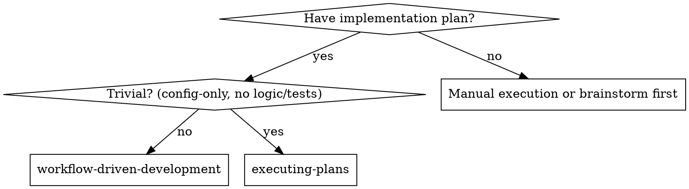

# Workflow-Driven Development

Orchestrate implementation plan execution via Claude Code Dynamic Workflows. You prepare the plan context and build workflow arguments; the Workflow runtime handles parallel dispatch, review chains, retry loops, and progress tracking.

## When to Use



**Default: workflow-driven.** Only fall back to executing-plans for trivial tasks (config-only, no new logic, no tests, no review loop).

**Continuous execution:** Do not pause to check in with your human partner between tasks. The workflow runs autonomously in the background. The only reasons to stop are: BLOCKED tasks you cannot resolve after workflow completion, ambiguity that genuinely prevents progress, or all tasks complete. "Should I continue?" prompts and progress summaries waste their time — they asked you to execute the plan, so execute it.

## How It Works

You do four things:

1. **Prepare context** — read the plan, extract tasks, build dependency graph
2. **Build args** — construct the workflow args object with groups and tasks
3. **Launch** — call `Workflow()` once; it runs in the background
4. **Handle results** — inspect the six result partitions, evidence, and final review

The Workflow runtime executes `execute-plan.workflow.js`, a self-contained script that embeds all prompt logic (behavioral guards, self-review checklists, adversarial review stances) drawn from the canonical prompt templates. You do not manage pools, review triggers, or retry logic — the runtime does that.

### Workflow Boundary

The workflow scripts accept a flat `args` object and return a structured result. The runtime boundary is:

```
Workflow({ scriptPath: '<path-to-script>' }, args) → result
```

For execute-plan, `args` requires: `{ groups, tasks, worktree, model_tasks }`.
For full-auto-pipeline, `args` requires: `{ task, worktree, specs_dir, plans_dir, execute_plan_script_path, model_tasks, max_retries, state_file, audit_dir, evidence_dir, resume_from, retry_policy, allowed_escalation_models, allow_commit, flow_state_script_path }`.

## Step 1: Prepare Context

Read the plan file once. For every task, extract:

- `id` — task identifier (e.g. "task-1")
- `description` — the FULL text from the plan (all implementation details)
- `depends_on` — array of task IDs this task must wait for (empty if none)
- `complexity` — simple, full-stack, ui, design, research

Build the dependency graph. Group tasks by topological level:

- Level 0: tasks with empty `depends_on`
- Level 1: tasks that depend only on Level 0 tasks
- Level N: tasks that depend only on earlier levels

Read `./execute-plan.workflow.js` — this is the workflow script. The script is self-contained: all agent prompts (behavioral guards, self-review checklists, review dimensions) are embedded in it.

If any task involves UI, read the root `DESIGN.md`. Include relevant design tokens, layout rules, component states, and accessibility requirements in that task's description text.

## Step 2: Build Args

Construct the `args` object:

| Key | Value |
|-----|-------|
| `groups` | Array of arrays. `groups[0]` = Level 0 task IDs, `groups[1]` = Level 1, etc. |
| `tasks` | Object keyed by task ID. Each value contains task metadata (see Rich Task Metadata below) |
| `worktree` | Absolute path to current worktree |
| `model_tasks` | `null` (use session model) or a model name string (see Model Selection) |

The workflow script embeds all prompt content — you only pass data. No prompt templates to read or pass.

For **full-auto pipeline mode**, also read `./full-auto-pipeline.workflow.js` and construct the extended args with `task`, `specs_dir`, `plans_dir`, `execute_plan_script_path`, `model_tasks`, `max_retries`.

### Rich Task Metadata

Each task entry supports these fields. Defaults are applied automatically by the pipeline for any missing optional fields.

| Field | Required | Type | Default | Description |
|-------|----------|------|---------|-------------|
| `id` | yes | string | — | Task identifier (e.g. "task-1") |
| `description` | yes | string (minLength 1) | — | Full implementation details from the plan |
| `depends_on` | no | string[] | `[]` | Task IDs this task must wait for |
| `files` | no | string[] | `[]` | Files this task is expected to modify |
| `tests` | no | string[] | `[]` | Test files this task should create or modify |
| `verification` | no | string[] | `[]` | Commands to verify this task's output |
| `acceptance_refs` | no | string[] | `[]` | References to acceptance criteria |
| `runtime_evidence_required` | no | `required` / `optional` / `not_needed` | `optional` | Whether runtime evidence gate applies |
| `risk` | no | `low` / `medium` / `high` / `critical` | `medium` | Task risk level |
| `subsystem` | no | string | `unknown` | Subsystem tag for cross-task coordination |

**Metadata enforcement:** High and critical risk tasks require `files`, `tests`, and `verification` fields. Tasks with `runtime_evidence_required: "required"` require `verification` and `acceptance_refs`. Plan validation rejects tasks that are missing required metadata for their risk level.

## Step 3: Launch

```
Workflow({
  script: <contents of execute-plan.workflow.js>,
  args: { groups, tasks, worktree, model_tasks }
})
```

Announce: "Using workflow-driven development: N tasks in M dependency groups."

The workflow runs in the background. Use `/workflows` to watch progress. Your session stays responsive — you can continue other work while the workflow executes.

## Step 4: Handle Results

When the workflow completes, inspect the returned `results` object. Tasks are classified into exactly one of six result partitions:

### Result Partitions

**`results.passed[]`** — tasks that passed all reviews and the final review. Each entry has:
- `id` — task identifier
- `spec_passed` — boolean
- `code_passed` — boolean
- `code_review` — full review result with `issues[]` and `summary`
- `files` — array of files modified
- `evidence` — structured evidence (commit SHA, test results, verification commands, evidence paths, concerns, files modified)

**`results.completed[]`** — alias for `results.passed[]`. Always contains the same task IDs as `passed`. Present for backward compatibility.

**`results.blocked[]`** — tasks blocked at implementation with a classified reason:
- `id` — task identifier
- `reason` — why it was blocked
- `classification` — blocker taxonomy category (see Blocker Taxonomy below)
- `impl` — last implementation attempt result

**`results.stalled[]`** — tasks that completed review loops without resolution but were not explicitly blocked:
- `id` — task identifier
- `stage` — which review stage stalled
- `evidence` — evidence gathered so far

**`results.failed_review[]`** — tasks where spec review or code review exhausted retry cap with blocking issues:
- `id` — task identifier
- `stage` — `spec_review` or `code_review`
- `blocking_issues` — issues that could not be resolved
- `iterations` — number of review iterations attempted
- `evidence` — evidence gathered up to the failed review

**`results.needs_escalation[]`** — tasks where the full escalation ladder was exhausted:
- `id` — task identifier
- `reason` — escalation reason
- `classification` — blocker taxonomy category
- `rung_reached` — which escalation stage was the last attempt
- `impl` — last implementation attempt result

**`results.final_review`** — cross-task code review (present if all tasks passed). If it has Critical issues, fix them before proceeding.

**Invariants:** Every task appears in exactly one partition. `completed` always equals `passed`. The union of all canonical partition ID sets equals all task IDs.

If all tasks are in `results.passed` and `results.final_review` has no Critical issues, proceed to **claude-code-flow:finishing-a-development-branch**.

### Blocker Taxonomy

Every blocked task is classified into one of these categories:

| Category | Description |
|----------|-------------|
| `agent_output_invalid` | Agent produced malformed or unusable output |
| `merge_conflict` | Unresolvable merge conflict |
| `permissions` | Permission denied on file or resource |
| `external_service` | External service unavailable or errored |
| `tooling_unavailable` | Required tool not installed or not found |
| `test_failure` | Tests fail and cannot be fixed by agent |
| `runtime_failure` | Runtime smoke test fails |
| `dependency_failure` | Dependency installation or resolution failure |
| `architecture_decision` | Blocked on an architectural decision |
| `scope_too_large` | Task is too large for a single agent |
| `missing_context` | Agent lacks necessary context |

### Escalation Ladder

The pipeline climbs these stages automatically when a task is blocked:

| Stage | Max Attempts | Description |
|-------|-------------|-------------|
| `schema_retry` | 1 | Retry with same prompt, fresh agent |
| `self_service_retry` | 2 | Retry with a self-service prompt providing guidance |
| `stronger_model` | 1 | Retry with a more capable model |
| `split_subtask` | 1 | Split task into smaller sub-tasks |
| `enriched_context` | 1 | Retry with additional context from codebase search |
| `ask_user` | 1 | Escalate to human partner |

### Review Threshold Table

Whether a review issue blocks progression depends on the review stage, task risk, and issue severity:

**Spec Review and Code Review:**

| Risk | Critical | High | Important | Minor | Info |
|------|----------|------|-----------|-------|------|
| `low` | BLOCKS | BLOCKS | if_explicit | no | no |
| `medium` | BLOCKS | BLOCKS | BLOCKS | no | no |
| `high` | BLOCKS | BLOCKS | if_explicit | no | no |
| `critical` | BLOCKS | BLOCKS | BLOCKS | BLOCKS | no |

**Final Review (risk-independent):**

| Critical | High | Important | Minor | Info |
|----------|------|-----------|-------|------|
| BLOCKS | BLOCKS | BLOCKS | no | no |

`if_explicit` means the issue blocks only if it is explicitly flagged as `blocking=true` by the reviewer.

### Handling Blocked Tasks

For each task in `results.blocked[]` or `results.needs_escalation[]`:

1. **Re-dispatch with a more capable model** — if the task requires more reasoning, use forge or oracle
2. **Split into smaller sub-tasks** — if the task was too large for one agent
3. **Escalate to your human partner** — if the plan itself is wrong

Never re-dispatch the same task with the same model and same instructions. If the workflow's built-in retry could not complete it, something needs to change.

## Task Status Handling

The workflow handles task statuses automatically. Tasks progress through these statuses:

| Status | Meaning |
|--------|---------|
| `queued` | Waiting for dependencies to complete |
| `implementing` | Agent is implementing the task |
| `implemented` | Implementation complete, awaiting review |
| `spec_reviewing` | Spec review in progress |
| `code_reviewing` | Code review in progress |
| `passed` | All reviews passed |
| `blocked` | Blocked at implementation, classified reason |
| `stalled` | Review loops exhausted without resolution |
| `failed_review` | Spec or code review exhausted retry cap |
| `failed` | Task failed irrecoverably |
| `split` | Task was split into sub-tasks |

### Implementer Status Mapping

| Implementer Status | Workflow Behavior |
|---------------------|------------------|
| **DONE** | Proceeds to spec review automatically |
| **DONE_WITH_CONCERNS** | Concerns flow into review context. If about correctness/scope, surface in spec review. If observations (e.g. "file getting large"), noted but workflow proceeds. |
| **BLOCKED** | Workflow climbs the escalation ladder (see Escalation Ladder). If all stages exhausted, task appears in `results.needs_escalation[]`. |

The workflow implements retry loops: up to 5 iterations per review stage. Spec review failures trigger fix-and-re-review. Code quality Critical and High issues trigger fix-and-re-review. Whether Important and Minor issues block depends on the Review Threshold Table above.

## Gate Predicates and Evidence Manifest

When running the full-auto pipeline, seven completion gates run in order after execution. Each gate has a specific predicate and produces an enriched record.

| Gate | Predicate | Evidence |
|------|-----------|----------|
| `tasks_executed` | `blocked.length === 0` | Completion counts |
| `reviews_passed` | Every completed task has `code_passed === true` | Per-task review results |
| `tests_pass` | Project test command exits 0 | Test output |
| `runtime_evidence` | Build/run smoke succeeds, no crash/hang, manifest generated | Runtime evidence manifest |
| `spec_verified` | Each spec requirement found in codebase | Spec path |
| `final_review` | Cross-task review returns approved | Review result |
| `git_clean` | `git status --porcelain` empty | Working tree status |

Gate 4 produces a runtime evidence manifest:

```json
{
  "commands": "<commands run>",
  "exit_codes": [0],
  "logs": [],
  "screenshots": [],
  "artifacts": [],
  "crash": false,
  "hang": false,
  "unverified_acceptance_items": [],
  "blocking_risks": [],
  "generated_at": "<ISO 8601>"
}
```

Gate 7 (`git_clean`) is validation-only: it does NOT instruct the agent to commit. Commits are made during the execute phase, not during gates.

### Task Evidence Schema

Each passed task carries structured evidence from the implementer:

| Field | Type | Description |
|-------|------|-------------|
| `commit_sha` | string | Git commit SHA for the implementation |
| `test_results` | string | Summary of test output |
| `verification_commands` | string[] | Commands used to verify the task output |
| `evidence_paths` | string[] | Paths to evidence artifacts on disk |
| `concerns` | string[] | Concerns raised by the implementer |
| `files_modified` | string[] | Files created or modified by the task |

## Model Selection

Set `model_tasks` in workflow args to override the session model for all workflow agents:

| Model | Role | When to Use |
|-------|------|-------------|
| Default (session model) | General implementation | Mechanical tasks: 1-2 files, complete spec |
| **forge** (Sonnet) | Full-stack implementation | Multi-file coordination, UI, complex logic |
| **oracle** (Opus) | Planning, architecture | System decomposition, ambiguous requirements |
| **prism** (Sonnet) | Verification | Test engineering, build, acceptance gates |
| **artist** (Sonnet) | Image generation | Visual asset creation and editing |

**Task complexity signals:**
- Touches 1-2 files, complete spec → default
- Full-stack, UI, multi-file coordination → forge
- Requires plan creation or architecture → oracle
- Requires test engineering or acceptance gate → prism
- Image generation or editing → artist

The workflow script embeds all prompt content (behavioral guards, self-review checklists, review dimensions). `model_tasks` sets the model for all workflow agents — the same prompts are used regardless of model. The canonical prompt files (`implementer-prompt.md`, `forge-implementer-prompt.md`, etc.) are reference documentation for non-workflow use.

## Image Generation

For tasks that generate or edit images, set the task model to artist. The workflow handles image tasks in the same implement → review chain. Artist agents return output paths plus a manifest. Tasks with missing output files or BLOCKED status appear in `results.blocked[]`.

## UI Implementation

For tasks involving visible UI, read the root `DESIGN.md` and include relevant design content (tokens, layout rules, component states, accessibility requirements) directly in the task's `description` text before building args. The workflow's spec review stage verifies that UI output matches the task description.

## Verification

For runnable deliverables, implementers must produce test results and commit SHAs. These flow through the workflow's structured output schemas (`IMPLEMENT_RESULT`, `REVIEW_RESULT`) and appear in `results.completed[].code_review`. The workflow's final cross-task review re-verifies the complete change set.

## Commit Policy

- Commits are normal git commits. Your human partner can `git revert` or `git reset` if unhappy.
- No automatic PR creation. The pipeline commits to the worktree branch. PR creation is a separate step handled by the finishing skill only if your human partner requests it.
- Gate 7 validates that the working tree is clean but does NOT instruct the agent to commit.
- The `allow_commit` arg controls whether agents in the pipeline may commit. Defaults to `true`.

## Red Flags

**Never:**
- Start implementation on main/master branch without explicit user consent
- Skip reading the plan file before building workflow args
- Make the workflow read plan files (provide full task text in args)
- Modify `execute-plan.workflow.js` at launch time
- Ignore blocked tasks in results
- Proceed without fixing Critical issues from `results.final_review`
- Interrupt or cancel the workflow mid-execution (let it finish; review results after)

**Always:**
- Build the dependency graph from the plan before launching
- Include FULL task descriptions in args (not just IDs or summaries)
- Read `DESIGN.md` for UI tasks and include relevant content in task descriptions
- Use `/workflows` to check progress if the run is taking a while
- Handle each blocked task individually after workflow completion
- Proceed to `claude-code-flow:finishing-a-development-branch` only after all tasks pass

**If the workflow returns blocked tasks:**
- Re-dispatch with a more capable model (same prompt, better model)
- Split oversized tasks into smaller pieces
- Escalate to your human partner for plan-level issues
- Do NOT manually implement blocked tasks in your session (context pollution defeats subagent isolation)

## Integration

**Required workflow skills:**
- **claude-code-flow:using-git-worktrees** — Ensures isolated workspace
- **claude-code-flow:writing-plans** — Creates the plan this skill executes
- **claude-code-flow:requesting-code-review** — Code review template for reviewer agents
- **claude-code-flow:finishing-a-development-branch** — Complete development after all tasks

**Subagents should use:**
- **claude-code-flow:test-driven-development** — Follow TDD for each task

**Alternative workflow:**
- **claude-code-flow:executing-plans** — Use for trivial tasks (config-only, no logic)
